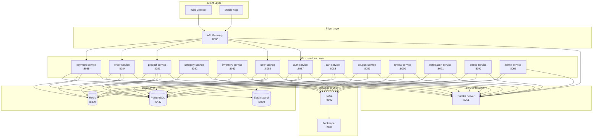
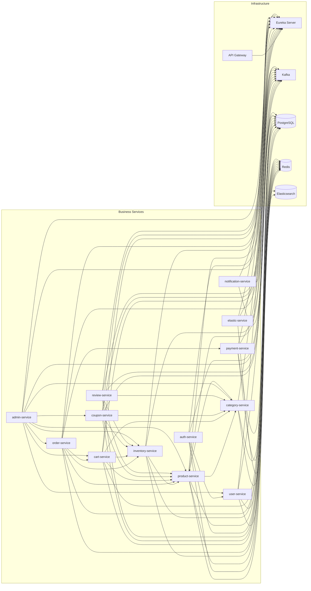
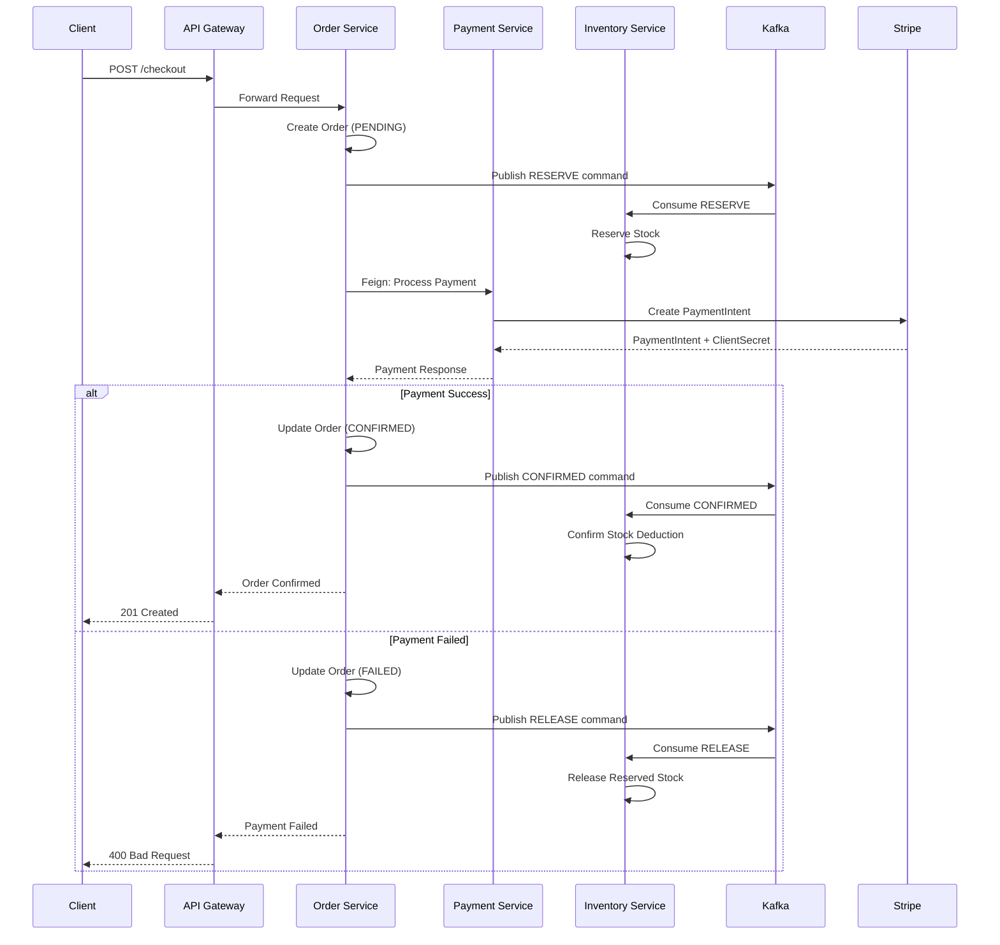
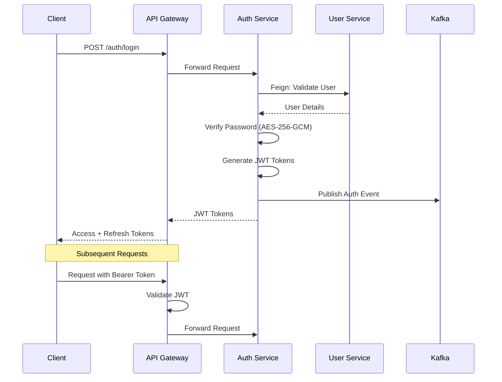
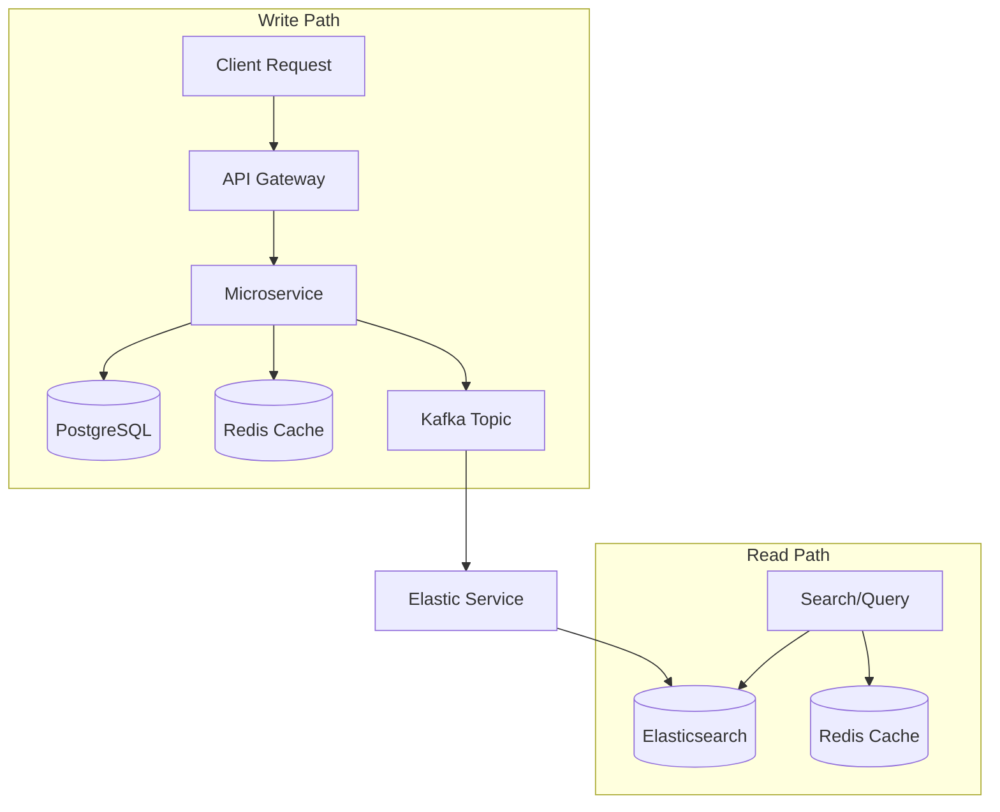

# ShopFast E-Commerce Platform

A production-grade, microservices-based e-commerce platform built with Spring Boot 3, Spring Cloud, and modern cloud-native technologies. The platform follows a domain-driven design with database-per-service pattern, event-driven architecture, and comprehensive observability.

---

## Table of Contents

1. [Architecture Overview](#architecture-overview)
2. [Technology Stack](#technology-stack)
3. [Backend Services](#backend-services)
4. [Service Communication](#service-communication)
5. [Architecture Diagrams](#architecture-diagrams)
6. [Data Architecture](#data-architecture)
7. [Security](#security)
8. [Deployment](#deployment)
9. [Getting Started](#getting-started)

---

## Architecture Overview

ShopFast is built on a **microservices architecture** with the following key characteristics:

- **16 Backend Microservices** + **1 Shared Library**
- **Service Discovery** via Netflix Eureka
- **API Gateway** for unified entry point with rate limiting
- **Event-Driven Architecture** using Apache Kafka
- **Database-per-Service** pattern with PostgreSQL
- **Caching** layer with Redis
- **Search** capabilities with Elasticsearch
- **Observability** with Spring Actuator, Prometheus metrics, and health checks

---

## Technology Stack

### Core Frameworks
| Technology | Version | Purpose |
|------------|---------|---------|
| Java | 17 | Programming Language |
| Spring Boot | 3.3.5 | Application Framework |
| Spring Cloud | 2023.0.3 | Microservices Ecosystem |
| Maven | - | Build Tool |

### Service Communication
| Technology | Version | Purpose |
|------------|---------|---------|
| Netflix Eureka | - | Service Discovery & Load Balancing |
| Spring Cloud Gateway | - | API Gateway, Routing, Rate Limiting |
| OpenFeign | - | Declarative REST Client |
| Apache Kafka | 7.6.1 | Event Streaming & Async Communication |
| Zookeeper | 7.6.1 | Kafka Coordination |

### Data & Storage
| Technology | Version | Purpose |
|------------|---------|---------|
| PostgreSQL | 15 | Primary Database (12 databases) |
| Redis | 7 | Caching, Session Store, Cart Storage |
| Elasticsearch | 8.19.5 | Full-text Search & Product Indexing |

### Security & Authentication
| Technology | Version | Purpose |
|------------|---------|---------|
| JWT (JJWT) | 0.11.5 | Authentication & Authorization |
| Spring Security | - | Security Framework |
| AES-256-GCM | - | Password Encryption |

### Resilience & Observability
| Technology | Version | Purpose |
|------------|---------|---------|
| Resilience4j | 2.2.0 | Circuit Breaker, Retry, Rate Limiter |
| Spring Actuator | - | Health Checks, Metrics, Monitoring |
| SpringDoc OpenAPI | 2.6.0 | API Documentation (Swagger UI) |
| Prometheus | - | Metrics Collection |

### Development Tools
| Technology | Version | Purpose |
|------------|---------|---------|
| Lombok | 1.18.34 | Boilerplate Reduction |
| MapStruct | 1.6.0 | DTO Mapping |
| TestContainers | 1.20.3 | Integration Testing |
| JavaFaker | 1.0.2 | Test Data Generation |
| Stripe SDK | - | Payment Processing |

### Frontend
| Technology | Version | Purpose |
|------------|---------|---------|
| Angular | 20.1.0 | Frontend Framework |
| Angular SSR | 20.1.3 | Server-Side Rendering |
| Chart.js | 4.5.1 | Analytics & Reporting |
| RxJS | 7.8.0 | Reactive Programming |

---

## Backend Services

### Service Registry & Gateway

#### 1. Eureka Server (`eureka-server`)
- **Port:** 8761
- **Purpose:** Service discovery and registration for all microservices
- **Technology:** Spring Cloud Netflix Eureka
- **Key Features:**
  - Service registration and discovery
  - Health monitoring
  - Load balancing support

#### 2. API Gateway (`api-gateway`)
- **Port:** 8080
- **Purpose:** Single entry point for all client requests
- **Technology:** Spring Cloud Gateway
- **Key Features:**
  - Dynamic routing via Eureka
  - Rate limiting (Redis-based)
  - JWT authentication
  - Request/Response logging
  - Circuit breaker integration

---

### Core Business Services

#### 3. Auth Service (`auth-service`)
- **Port:** 8087
- **Database:** `auth_db`
- **Purpose:** User authentication and JWT token management
- **Key Features:**
  - Login/Logout with JWT
  - Password encryption (AES-256-GCM)
  - Token refresh mechanism
  - Feign client to user-service for validation
  - Kafka integration for auth events

#### 4. User Service (`user-service`)
- **Port:** 8086
- **Database:** `user_db`
- **Purpose:** User profile and account management
- **Key Features:**
  - User CRUD operations
  - Address management
  - Kafka consumer for user events
  - Redis caching
  - Eureka registration

---

### Product & Catalog Services

#### 5. Product Service (`product-service`)
- **Port:** 8081
- **Database:** `product_db`
- **Purpose:** Product catalog management
- **Key Features:**
  - Product CRUD operations
  - Product search via Elasticsearch
  - Kafka producer/consumer for product events
  - Redis caching
  - Feign client to category-service
  - Seed data support

#### 6. Category Service (`category-service`)
- **Port:** 8082
- **Database:** `category_db`
- **Purpose:** Product category management
- **Key Features:**
  - Category hierarchy management
  - Feign client to product-service
  - Redis caching
  - Seed data support

---

### Shopping Services

#### 7. Cart Service (`cart-service`)
- **Port:** 8088
- **Database:** `cart_db` + Redis
- **Purpose:** Shopping cart management
- **Key Features:**
  - User and guest cart support
  - Redis-backed cart storage (14-day TTL for guests)
  - Cart validation against product/inventory
  - Kafka integration

#### 8. Coupon Service (`coupon-service`)
- **Port:** 8089
- **Database:** `coupon_db`
- **Purpose:** Coupon and discount management
- **Key Features:**
  - Coupon creation and validation
  - Discount calculation
  - Kafka integration
  - Redis caching

#### 9. Inventory Service (`inventory-service`)
- **Port:** 8083
- **Database:** `inventory_db`
- **Purpose:** Stock and inventory management
- **Key Features:**
  - Stock tracking
  - Reservation system (via Kafka order commands)
  - Low stock alerts
  - Kafka consumer for RESERVE/CONFIRMED/RELEASE commands
  - Seed data support

---

### Order & Payment Services

#### 10. Order Service (`order-service`)
- **Port:** 8084
- **Database:** `order_db`
- **Purpose:** Order processing and management
- **Key Features:**
  - Order creation and checkout flow
  - Feign client to payment-service
  - Kafka producer for order commands (RESERVE, CONFIRMED, RELEASE)
  - Order status tracking
  - Admin order management endpoints
  - Integration with cart, product, inventory services

#### 11. Payment Service (`payment-service`)
- **Port:** 8085
- **Database:** `payment_db`
- **Purpose:** Payment processing and transaction management
- **Key Features:**
  - Stripe integration (PaymentIntents, Webhooks)
  - Cash on Delivery (COD) support
  - Mock card payment gateway
  - Idempotency via Redis
  - Kafka producer for payment events
  - Webhook handling for Stripe

---

### Support Services

#### 12. Review Service (`review-service`)
- **Port:** 8090
- **Database:** `review_db`
- **Purpose:** Product review and rating management
- **Key Features:**
  - Review CRUD operations
  - Rating aggregation
  - Kafka integration
  - Redis caching

#### 13. Notification Service (`notification-service`)
- **Port:** 8091
- **Database:** `notification_db`
- **Purpose:** Email and notification dispatch
- **Key Features:**
  - Email notifications (SMTP)
  - Kafka consumer for notification events
  - Notification tracking
  - Health check with mail disabled

#### 14. Elastic Service (`elastic-service`)
- **Port:** 8092
- **Database:** None (uses Elasticsearch)
- **Purpose:** Elasticsearch indexing and search synchronization
- **Key Features:**
  - Kafka consumer for product events
  - Elasticsearch document indexing
  - Search query handling
  - No database dependency

#### 15. Admin Service (`admin-service`)
- **Port:** 8093
- **Database:** `admin_db`
- **Purpose:** Administrative dashboard and management
- **Key Features:**
  - Aggregated admin APIs
  - Feign clients to all major services
  - Kafka integration
  - Analytics and reporting support

---

### Shared Library

#### 16. Common Library (`common-lib`)
- **Purpose:** Shared DTOs, events, enums, and utilities
- **Key Contents:**
  - Common DTOs (ProductDto, CategoryDto, OrderDto, etc.)
  - Event definitions (OrderCommand, PaymentEvent, ProductEvent, etc.)
  - Enums (NotificationChannel, NotificationStatus, etc.)
  - Password encryption utility
  - Elasticsearch product model

---

## Service Communication

### Communication Patterns

The platform uses **three primary communication patterns**:

```
┌─────────────────────────────────────────────────────────────────┐
│                    COMMUNICATION PATTERNS                       │
├─────────────────────────────────────────────────────────────────┤
│                                                                 │
│  1. SYNCHRONOUS (REST/Feign)                                   │
│     ├── API Gateway → Services (via Eureka)                     │
│     ├── Service-to-Service (Feign Clients)                      │
│     └── Direct HTTP calls with service discovery                │
│                                                                 │
│  2. ASYNCHRONOUS (Kafka Events)                                │
│     ├── Order Commands (order.commands topic)                   │
│     ├── Payment Events (payment.events topic)                   │
│     ├── Product Events (product.events topic)                   │
│     └── Notification Events (notification.events topic)         │
│                                                                 │
│  3. CACHING (Redis)                                            │
│     ├── Session caching                                        │
│     ├── Product/Category caching                                │
│     └── Cart storage (guest + user)                             │
│                                                                 │
└─────────────────────────────────────────────────────────────────┘
```

### Synchronous Communication (Feign Clients)

Services communicate synchronously using **Spring Cloud OpenFeign** with Eureka service discovery:

| Caller Service | Target Service | Purpose | Port |
|----------------|----------------|---------|------|
| api-gateway | All services | Routing | 8080 |
| auth-service | user-service | User validation | 8086 |
| order-service | payment-service | Process payment | 8085 |
| order-service | product-service | Product validation | 8081 |
| order-service | inventory-service | Stock check | 8083 |
| order-service | cart-service | Cart operations | 8088 |
| product-service | category-service | Category data | 8082 |
| admin-service | user-service | User management | 8086 |
| admin-service | order-service | Order management | 8084 |
| admin-service | cart-service | Cart management | 8088 |
| admin-service | category-service | Category management | 8082 |
| admin-service | product-service | Product management | 8081 |
| admin-service | inventory-service | Inventory management | 8083 |
| admin-service | coupon-service | Coupon management | 8089 |

### Asynchronous Communication (Kafka)

Services communicate asynchronously using **Apache Kafka** for event-driven workflows:

#### Kafka Topics & Producers

| Topic | Producer Service | Event Type | Consumer Services |
|-------|------------------|------------|-------------------|
| `order.commands` | order-service | RESERVE, CONFIRMED, RELEASE | inventory-service |
| `payment.events` | payment-service | PAYMENT_SUCCESS, PAYMENT_FAILED | order-service, notification-service |
| `product.events` | product-service | PRODUCT_CREATED, PRODUCT_UPDATED | elastic-service |
| `notification.events` | Various | ORDER_CONFIRMED, PAYMENT_SUCCESS | notification-service |

#### Order Flow (Kafka-based Saga)

```
┌─────────────┐     ┌─────────────┐     ┌─────────────┐
│   Checkout  │────▶│  Order Svc  │────▶│ Inventory   │
│   Request   │     │ (Create     │     │ (Reserve    │
│             │     │  Order)     │     │  Stock)     │
└─────────────┘     └──────┬──────┘     └─────────────┘
                           │
                           ▼
                  ┌─────────────────┐
                  │ Kafka Topic:    │
                  │ order.commands  │
                  │ (RESERVE)       │
                  └────────┬────────┘
                           │
                           ▼
                  ┌─────────────────┐
                  │ Inventory Svc   │
                  │ (Consume &      │
                  │  Reserve Stock) │
                  └─────────────────┘
```

#### Payment Flow

```
┌─────────────┐     ┌─────────────┐     ┌─────────────┐
│   Order Svc │────▶│ Payment Svc │────▶│   Stripe    │
│ (Feign Call)│     │ (Process    │     │  (External) │
│             │     │  Payment)   │     │             │
└─────────────┘     └──────┬──────┘     └─────────────┘
                           │
                           ▼
                  ┌─────────────────┐
                  │ Kafka Topic:    │
                  │ payment.events  │
                  └────────┬────────┘
                           │
                           ▼
                  ┌─────────────────┐
                  │ Order Svc       │
                  │ (Update Order   │
                  │  Status)        │
                  └─────────────────┘
```

---

## Architecture Diagrams

### High-Level System Architecture



### Service Dependency Graph



### Order Processing Flow (Saga Pattern)



### Authentication Flow



### Data Flow Architecture



---

## Data Architecture

### Database-per-Service Pattern

Each microservice owns its own database, ensuring loose coupling and independent scalability:

| Service | Database | Port |
|---------|----------|------|
| auth-service | `auth_db` | 5432 |
| user-service | `user_db` | 5432 |
| product-service | `product_db` | 5432 |
| category-service | `category_db` | 5432 |
| inventory-service | `inventory_db` | 5432 |
| order-service | `order_db` | 5432 |
| payment-service | `payment_db` | 5432 |
| cart-service | `cart_db` | 5432 |
| coupon-service | `coupon_db` | 5432 |
| review-service | `review_db` | 5432 |
| notification-service | `notification_db` | 5432 |
| admin-service | `admin_db` | 5432 |

### Caching Strategy

| Cache Type | Technology | TTL | Purpose |
|------------|------------|-----|---------|
| Product Cache | Redis | Configurable | Product details, categories |
| Cart Cache | Redis | 14 days (guest) | Shopping cart data |
| Session Cache | Redis | 1 hour | User sessions |
| Rate Limiter | Redis | Sliding window | API rate limiting |

### Search Architecture

- **Elasticsearch** indexes product data for full-text search
- **Elastic Service** consumes Kafka product events and maintains the search index
- Supports product search, filtering, and faceted navigation

---

## Security

### Authentication & Authorization

- **JWT-based authentication** with access and refresh tokens
- **Password encryption** using AES-256-GCM
- **Stateless** authentication suitable for microservices
- **API Gateway** validates JWT before routing requests

### Security Features

| Feature | Implementation |
|---------|----------------|
| Authentication | JWT (JJWT 0.11.5) |
| Password Hashing | AES-256-GCM |
| Token Expiry | 1 hour (access), 24 hours (refresh) |
| Rate Limiting | Redis-based (10 req/s, burst 20) |
| Service Communication | Internal network (Docker) |

---

## Deployment

### Docker Compose (Development)

The platform is containerized using Docker Compose with the following infrastructure:

```yaml
# Key Infrastructure Services
- PostgreSQL 15 (port 5432/5433)
- Redis 7 (port 6379)
- Kafka 7.6.1 + Zookeeper (ports 9092, 2181)
- Elasticsearch 8.19.5 (port 9200)
- Kafka UI (port 9093)
```

### Docker Compose (Production)

Production deployment includes:
- Restart policies (`unless-stopped`)
- Health checks for all services
- Environment variable configuration
- Volume persistence for data
- Network isolation (`shopfast-net`)

### Service Ports

| Service | Internal Port | External Port |
|---------|---------------|---------------|
| API Gateway | 8080 | 8080 (80 in prod) |
| Eureka Server | 8761 | 8761 |
| Auth Service | 8087 | 8087 |
| User Service | 8086 | 8086 |
| Product Service | 8081 | 8081 |
| Category Service | 8082 | 8082 |
| Inventory Service | 8083 | 8083 |
| Order Service | 8084 | 8084 |
| Payment Service | 8085 | 8085 |
| Cart Service | 8088 | 8088 |
| Coupon Service | 8089 | 8089 |
| Review Service | 8090 | 8090 |
| Notification Service | 8091 | 8091 |
| Elastic Service | 8092 | 8092 |
| Admin Service | 8093 | 8093 |
| PostgreSQL | 5432 | 5432 (5433 in dev) |
| Redis | 6379 | 6379 |
| Kafka | 9092 | 9092 |
| Elasticsearch | 9200 | 9200 |

---

## Getting Started

### Prerequisites

- Java 17+
- Maven 3.8+
- Docker & Docker Compose
- Node.js 20+ (for frontend)

### Running the Backend

1. **Clone the repository**
   ```bash
   git clone <repository-url>
   cd ecommerce/backend
   ```

2. **Start infrastructure services**
   ```bash
   docker-compose up -d postgres redis kafka zookeeper elasticsearch
   ```

3. **Build all services**
   ```bash
   ./mvnw clean install -DskipTests
   ```

4. **Start services (order matters)**
   ```bash
   # Start Eureka Server first
   cd eureka-server && ./mvnw spring-boot:run

   # Then start other services in separate terminals
   cd api-gateway && ./mvnw spring-boot:run
   cd auth-service && ./mvnw spring-boot:run
   cd user-service && ./mvnw spring-boot:run
   # ... and so on
   ```

5. **Or use Docker Compose for all services**
   ```bash
   docker-compose up --build
   ```

### Running the Frontend

```bash
cd ../../frontend
npm install
npm start
```

### Accessing Services

| Service | URL |
|---------|-----|
| API Gateway | http://localhost:8080 |
| Eureka Dashboard | http://localhost:8761/eureka |
| Kafka UI | http://localhost:9093/kafka |
| Elasticsearch | http://localhost:9200 |

### API Documentation

Each service exposes Swagger UI at:
```
http://localhost:<port>/swagger-ui.html
```

---

## Project Structure

```
ecommerce/
├── backend/
│   ├── common-lib/           # Shared library (DTOs, events, enums)
│   ├── eureka-server/        # Service discovery
│   ├── api-gateway/          # API gateway
│   ├── auth-service/         # Authentication
│   ├── user-service/         # User management
│   ├── product-service/      # Product catalog
│   ├── category-service/     # Category management
│   ├── inventory-service/    # Inventory management
│   ├── order-service/        # Order processing
│   ├── payment-service/      # Payment processing
│   ├── cart-service/         # Shopping cart
│   ├── coupon-service/       # Coupon management
│   ├── review-service/       # Product reviews
│   ├── notification-service/ # Notifications
│   ├── elastic-service/      # Elasticsearch indexing
│   ├── admin-service/        # Admin dashboard
│   ├── docker-compose.yml    # Development compose
│   ├── docker-compose.prod.yml # Production compose
│   └── pom.xml               # Parent POM
├── frontend/                 # Angular application
│   └── src/
└── README.md
```

---

## Key Design Patterns

1. **Microservices Pattern** - Independent, loosely coupled services
2. **Database-per-Service** - Each service owns its data
3. **API Gateway Pattern** - Single entry point for clients
4. **Service Discovery** - Dynamic service location via Eureka
5. **Event-Driven Architecture** - Async communication via Kafka
6. **Saga Pattern** - Distributed transaction management
7. **CQRS** - Command Query Responsibility Segregation (with Elasticsearch)
8. **Circuit Breaker** - Resilience4j for fault tolerance
9. **Caching** - Redis for performance optimization
10. **Idempotency** - Redis-based idempotency for payments

---

## Monitoring & Observability

- **Health Checks:** Spring Actuator `/actuator/health`
- **Metrics:** Prometheus format at `/actuator/prometheus`
- **API Docs:** Swagger UI at `/swagger-ui.html`
- **Service Registry:** Eureka Dashboard at `http://localhost:8761/eureka`
- **Kafka Management:** Kafka UI at `http://localhost:9093/kafka`

---

## License

This project is proprietary and confidential.

---

*Generated for ShopFast E-Commerce Platform - Backend Services Documentation*
