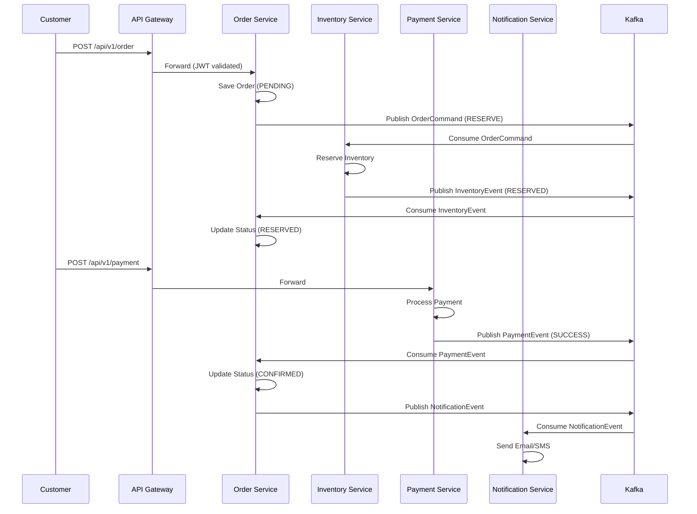

# 🏗️ Behind the Scenes: ShopFast's Microservices Architecture Deep Dive

Ever wondered how a production-grade e-commerce platform is architected at scale? Today, I'm breaking down the complete backend architecture of **ShopFast** — a microservices-based e-commerce system I designed and built from scratch.

---

## 🎯 The Challenge

Building an e-commerce platform that can handle:
- High traffic during sales and promotions
- Complex order fulfillment workflows
- Real-time inventory management
- Secure payment processing
- Scalable search capabilities
- Admin management across multiple domains

The solution? A **cloud-native microservices architecture** with event-driven communication.

---

## 🏛️ Complete Architecture Overview

```
┌─────────────────────────────────────────────────────────────────────────────┐
│                           CLIENT APPLICATIONS                                │
│  ┌──────────────┐  ┌──────────────┐  ┌──────────────────────────────────┐   │
│  │   Frontend   │  │    Mobile    │  │        Admin Dashboard           │   │
│  │  (Angular)   │  │     App      │  │   (Product/Category/Order/       │   │
│  │  Port: 4200  │  │  (iOS/Android)│  │    User/Inventory/Coupon Mgmt)   │   │
│  └──────┬───────┘  └──────┬───────┘  └──────────────────────────────────┘   │
└─────────┼─────────────────┼────────────────────────────────────────────────┘
          │                 │
          └─────────────────┼────────────────────────────────────────────────┘
                            │ HTTPS
┌───────────────────────────▼─────────────────────────────────────────────────┐
│                        API GATEWAY (Port: 8080)                               │
│  ┌────────────────────────────────────────────────────────────────────────┐ │
│  │  • JWT Authentication & Authorization                                   │ │
│  │  • Rate Limiting (Redis-backed, per IP)                                 │ │
│  │  • Dynamic Routing via Eureka Service Discovery                         │ │
│  │  • CORS Configuration                                                   │ │
│  │  • Request/Response Logging                                             │ │
│  │  • Circuit Breaker (Resilience4j)                                       │ │
│  └────────────────────────────────────────────────────────────────────────┘ │
└───────────────────────────┬─────────────────────────────────────────────────┘
                            │
                            │ Routes to services via Eureka
                            │
┌───────────────────────────▼─────────────────────────────────────────────────┐
│                    SERVICE DISCOVERY (Eureka Server: 8761)                    │
│  • Service Registry & Health Monitoring                                      │
│  • Dynamic Service Location                                                  │
│  • Load Balancing                                                            │
└──────────────────────────────────────────────────────────────────────────────┘
                            │
        ┌───────────────────┼───────────────────┬───────────────────┐
        │                   │                   │                   │
┌───────▼────────┐  ┌────────▼────────┐  ┌──────▼────────┐  ┌──────▼────────┐
│  AUTH SERVICE  │  │  USER SERVICE   │  │ PRODUCT SVC   │  │ CATEGORY SVC  │
│   Port: 8087   │  │   Port: 8086    │  │  Port: 8081   │  │  Port: 8082   │
│                │  │                 │  │               │  │               │
│ • Login/Logout │  │ • User Profile  │  │ • Product CRUD│  │ • Category    │
│ • JWT Generation│ │ • User List     │  │ • Product     │  │   Management  │
│ • Token Refresh │  │ • User Search   │  │   Search      │  │ • Category    │
│ • Password      │  │ • User Events   │  │ • Product     │  │   Hierarchy   │
│   Encryption    │  │                 │  │   Events      │  │               │
│                │  │                 │  │               │  │               │
│ Database:      │  │ Database:       │  │ Database:     │  │ Database:     │
│  auth_db       │  │  user_db        │  │  product_db   │  │  category_db  │
│                │  │                 │  │               │  │               │
│ Kafka:         │  │ Kafka:          │  │ Kafka:        │  │ Kafka:        │
│  (Consumer)    │  │  user.events    │  │ product.events│  │ (Producer)    │
│                │  │                 │  │               │  │               │
│ Redis:         │  │ Redis:          │  │ Redis:        │  │ Redis:        │
│  Session Cache │  │  User Cache     │  │ Product Cache │  │ Category Cache│
└────────────────┘  └─────────────────┘  └───────────────┘  └───────────────┘

┌────────────────┐  ┌────────────────┐  ┌────────────────┐  ┌────────────────┐
│ CART SERVICE   │  │ COUPON SERVICE │  │ REVIEW SERVICE │  │ INVENTORY SVC  │
│  Port: 8088    │  │  Port: 8089    │  │  Port: 8090    │  │  Port: 8083    │
│                │  │                │  │                │  │                │
│ • Cart CRUD    │  │ • Coupon       │  │ • Review CRUD  │  │ • Stock Mgmt   │
│ • Cart Merge   │  │   Management   │  │ • Rating       │  │ • Reservation  │
│   (Guest→User) │  │ • Coupon       │  │   System       │  │ • Availability │
│ • Cart Events  │  │   Validation   │  │ • Review       │  │ • Low Stock    │
│                │  │ • Discount      │  │   Moderation   │  │   Alerts       │
│                │  │   Calculation  │  │                │  │                │
│ Database:      │  │ Database:      │  │ Database:      │  │ Database:      │
│  cart_db       │  │  coupon_db     │  │  review_db     │  │  inventory_db  │
│                │  │                │  │                │  │                │
│ Kafka:         │  │ Kafka:         │  │ Kafka:         │  │ Kafka:         │
│  (Consumer)    │  │  coupon.events │  │  (Consumer)    │  │  order.commands│
│                │  │                │  │                │  │                │
│ Redis:         │  │ Redis:         │  │ Redis:         │  │ Redis:         │
│  Cart Cache    │  │  (Minimal)     │  │  Review Cache  │  │  Stock Cache   │
└────────────────┘  └────────────────┘  └────────────────┘  └────────────────┘

┌────────────────┐  ┌────────────────┐  ┌────────────────┐  ┌────────────────┐
│  ORDER SERVICE │  │ PAYMENT SERVICE│  │ NOTIFICATION   │  │  ELASTIC SVC   │
│  Port: 8084    │  │  Port: 8085    │  │    SERVICE     │  │  Port: 8092    │
│                │  │                │  │  Port: 8091    │  │                │
│ • Order CRUD   │  │ • Payment      │  │ • Email        │  │ • Full-Text    │
│ • Checkout     │  │   Processing   │  │ • SMS          │  │   Search       │
│ • Order Status │  │ • Stripe/       │  │ • Push         │  │ • Product      │
│   Management   │  │   Razorpay     │  │   Notifications│  │   Indexing     │
│ • Order Events │  │   Integration  │  │ • Template     │  │ • Search       │
│ • Saga Pattern │  │ • Refund       │  │   Management   │  │   Suggestions  │
│ • Order Search │  │   Processing   │  │ • Notification │  │ • Faceted      │
│                │  │ • Payment      │  │   History      │  │   Search       │
│                │  │   Events       │  │                │  │                │
│ Database:      │  │ Database:      │  │ Database:      │  │ Database:      │
│  order_db      │  │  payment_db    │  │  notification_ │  │  (None - uses  │
│                │  │                │  │     db         │  │  Elasticsearch)│
│ Kafka:         │  │ Kafka:         │  │ Kafka:         │  │ Kafka:         │
│  order.commands│  │  payment.events│  │  notification. │  │  product.events│
│  payment.events│  │                │  │     events     │  │                │
│  notification. │  │                │  │                │  │                │
│     events     │  │                │  │                │  │                │
│                │  │                │  │                │  │                │
│ Redis:         │  │ Redis:         │  │ Redis:         │  │ Redis:         │
│  Order Cache   │  │  (Minimal)     │  │  (Minimal)     │  │  Search Cache  │
└────────────────┘  └────────────────┘  └────────────────┘  └────────────────┘

┌────────────────┐
│  ADMIN SERVICE │
│  Port: 8093    │
│                │
│ • Dashboard    │
│ • User Mgmt    │
│ • Product Mgmt │
│ • Order Mgmt   │
│ • Category Mgmt│
│ • Inventory    │
│   Mgmt         │
│ • Coupon Mgmt  │
│ • Cart Mgmt    │
│ • Analytics    │
│                │
│ Database:      │
│  admin_db      │
│                │
│ Kafka:         │
│  (Producer)    │
│                │
│ Redis:         │
│  (Minimal)     │
└────────────────┘
```

---

## 🔑 Key Architectural Decisions

### 1. **Database-per-Service Pattern**
Each microservice owns its data:
- **Auth Service** → `auth_db`
- **User Service** → `user_db`
- **Product Service** → `product_db`
- **Order Service** → `order_db`
- **Payment Service** → `payment_db`
- And 7 more databases...

**Why?** Loose coupling, independent scaling, and technology flexibility.

### 2. **Event-Driven Communication**
Instead of tight REST coupling, services communicate via Kafka events:

```
Order Service ───► Kafka ───► Inventory Service
     │                                       │
     └─── Publish: OrderCommand              └─── Consume: Reserve Inventory
                                                 │
                                                 └─── Publish: InventoryEvent
                                                         │
                                                    Order Service
                                                         │
                                                    Consume: Update Status
```

**Event Types:**
- `OrderCommand` — RESERVE, CONFIRM, RELEASE
- `InventoryEvent` — RESERVED, CONFIRMED, RELEASED, FAILED
- `PaymentEvent` — SUCCESS, FAILED, REFUNDED
- `NotificationEvent` — EMAIL, SMS, PUSH
- `ProductEvent` — CREATED, UPDATED, DELETED

### 3. **Saga Pattern for Order Processing**
Distributed transactions without 2PC:

```
Place Order (PENDING)
    ↓
Reserve Inventory (RESERVED)
    ↓
Process Payment (CONFIRMED)
    ↓
Send Notification (COMPLETED)

If any step fails → Compensating transaction (RELEASE inventory)
```

### 4. **CQRS with Elasticsearch**
- **Write path**: PostgreSQL (ACID transactions)
- **Read path**: Elasticsearch (full-text search, faceted filtering)

### 5. **API Gateway as Single Entry Point**
- JWT validation at the edge
- Rate limiting per IP (Redis-backed)
- Dynamic routing via Eureka service registry
- No direct service exposure to clients

---

## 🛠️ Technology Stack

| Layer | Technology | Purpose |
|-------|-----------|---------|
| **Runtime** | Java 17, Spring Boot 3.3.5 | Application framework |
| **Cloud** | Spring Cloud 2023.0.3 | Microservices patterns |
| **Discovery** | Netflix Eureka | Service registry |
| **Gateway** | Spring Cloud Gateway | Routing, rate limiting |
| **Security** | JWT (JJWT), AES-256-GCM | Auth & encryption |
| **Messaging** | Apache Kafka 7.6.1 | Event streaming |
| **Database** | PostgreSQL 15 | Primary data store |
| **Cache** | Redis 7 | Caching, rate limiting |
| **Search** | Elasticsearch 8.19.5 | Full-text search |
| **Resilience** | Resilience4j 2.2.0 | Circuit breaker, retry |
| **Container** | Docker Compose | Deployment |

---

## 📊 Service Communication Matrix

| Service | Port | Database | Kafka Topics | Redis Usage |
|---------|------|----------|--------------|-------------|
| API Gateway | 8080 | - | - | Rate Limiter |
| Auth Service | 8087 | auth_db | - | Session Cache |
| User Service | 8086 | user_db | user.events | User Cache |
| Product Service | 8081 | product_db | product.events | Product Cache |
| Category Service | 8082 | category_db | - | Category Cache |
| Inventory Service | 8083 | inventory_db | order.commands | Stock Cache |
| Order Service | 8084 | order_db | order.commands, payment.events | Order Cache |
| Payment Service | 8085 | payment_db | payment.events | - |
| Cart Service | 8088 | cart_db | - | Cart Cache |
| Coupon Service | 8089 | coupon_db | coupon.events | - |
| Review Service | 8090 | review_db | - | Review Cache |
| Notification Service | 8091 | notification_db | notification.events | - |
| Elastic Service | 8092 | - | product.events | Search Cache |
| Admin Service | 8093 | admin_db | - | - |

---

## 🔄 Complete Order Flow (Saga Pattern)



---

## 🎓 What This Architecture Teaches

1. **Microservices Decomposition** — Breaking down a monolith into domain-driven services
2. **Event-Driven Design** — Building reliable async workflows with Kafka
3. **Distributed Transactions** — Managing consistency without 2PC (Saga pattern)
4. **Service Communication** — When to use REST vs. events
5. **Resilience Patterns** — Circuit breakers, retries, and fallbacks
6. **Data Management** — Database-per-service vs. shared database trade-offs
7. **Security in Depth** — JWT, encryption, rate limiting at multiple layers
8. **Observability** — Metrics, health checks, and distributed tracing

---

## 🚀 Production Considerations

This architecture is designed for:
- **Horizontal scaling** — Each service can scale independently
- **Fault isolation** — One service failure doesn't cascade
- **Technology diversity** — Different services can use different tech stacks
- **Team autonomy** — Teams can own services end-to-end
- **CI/CD readiness** — Each service can be deployed independently

---

## 📚 Resources

- **Full Architecture Documentation**: [`ARCHITECTURE_DIAGRAM.md`](ARCHITECTURE_DIAGRAM.md)
- **GitHub Repository**: [ShopFast Platform](https://github.com/your-username/shopfast)
- **Docker Compose**: Complete infrastructure as code

---

## 💬 Discussion

What architectural patterns have you found most valuable in your microservices journey? I'd love to hear about your experiences with:
- Event-driven vs. REST communication
- Saga vs. 2PC for distributed transactions
- Database-per-service vs. shared database
- Service mesh vs. API gateway

Drop a comment below! 👇

---

#Microservices #SpringBoot #Java #Kafka #SpringCloud #Eureka #APIGateway #PostgreSQL #Redis #Elasticsearch #Docker #DistributedSystems #EventDrivenArchitecture #SagaPattern #SoftwareArchitecture #BackendDevelopment #ECommerce #SystemDesign #CloudNative #TechLeadership

---

*Architecture is not just about technology — it's about solving business problems with the right trade-offs. This project has been an incredible journey in mastering enterprise-grade distributed systems.* 🚀
