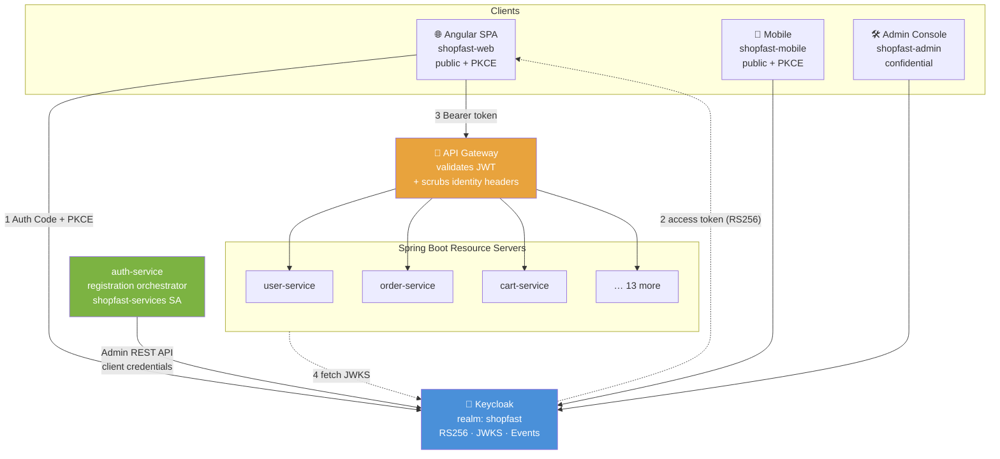
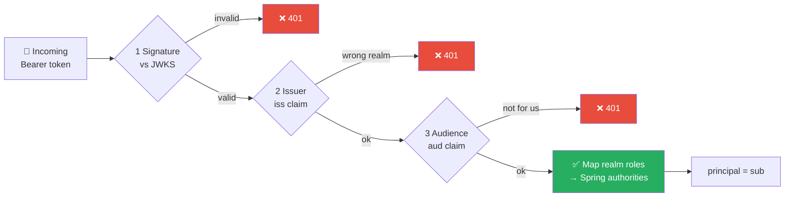
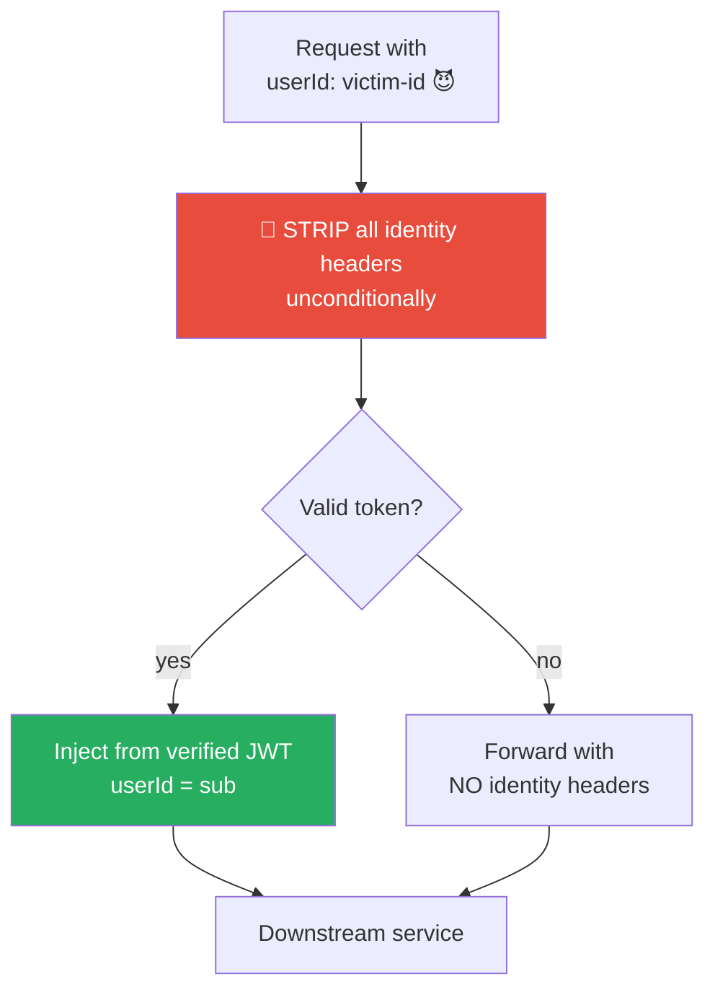

# 🔐 We Were Signing Our Own JWTs. Then I Realised Every Service Could Forge Them.

I replaced a hand-rolled authentication system with **Keycloak** across a 16-service Spring Boot platform. Here's the design, the reasoning, and the three production bugs that taught me the most.

---

## 🚨 The problem with "just use JJWT"

Our original setup looked reasonable on paper: `auth-service` issued **HS256** JWTs, every service validated them with a shared secret.

The flaw is in that last sentence. HS256 is **symmetric** — the same key verifies *and* signs.

> Every service that could validate a token could also mint one. A single compromised service compromised every identity on the platform.

Four structural problems, none fixable without changing the model:

| ❌ In-house HS256 | ✅ Keycloak |
|---|---|
| Shared secret in 16 services — any one can forge tokens | **RS256**: Keycloak holds the private key, services only get public JWKS |
| Key rotation = coordinated redeploy of everything | JWKS fetched at runtime — **rotation is automatic** |
| Lockout, password policy, reset flows = *our* code to get right | **Configuration, not code** |
| No SSO path; each new client = another auth implementation | One realm serves web, mobile, and admin |

---

## 🏛️ The architecture



**Four clients, three flows.** Browsers and mobile use **Authorization Code + PKCE** (public clients can't hold a secret — PKCE is what makes that safe). Internal service calls use **Client Credentials**.

`directAccessGrantsEnabled: false` on every browser-facing client. The password grant would have clients collecting raw credentials — defeating the entire point of federating authentication.

---

## 🎫 Three checks on every token

A signature alone only proves *"Keycloak issued this."* That is not enough.



- **Issuer** — without it, a token from *any other realm on that server* is accepted.
- **Audience** — in a multi-client realm, a token handed to a low-trust frontend would otherwise be **replayable against our APIs**.
- **`sub` as the principal** — never email or username. Both are user-mutable; using either as a database key corrupts ownership the first time someone changes their email.

---

## 🧩 One security config, not sixteen

Every service inherits its security from a **single Spring Boot auto-configuration** in a shared library.

This wasn't about saving typing. Per-service security config is *how microservice fleets drift apart* — one service ends up with CSRF enabled, another forgets the role converter, a third leaves `/actuator/env` exposed.

```java
.csrf(csrf -> csrf.disable())                    // no cookies → CSRF guards nothing
.sessionManagement(STATELESS)                    // the token is the entire state
.httpBasic(disable).formLogin(disable)           // bearer is the ONLY credential
.authorizeHttpRequests(auth -> auth
    .requestMatchers(OPTIONS, "/**").permitAll() // preflight is unauthenticated
    .requestMatchers(publicPaths).permitAll()
    .anyRequest().authenticated())               // 👈 default deny
```

**`anyRequest().authenticated()` is the load-bearing line.** A newly added endpoint is protected until someone *deliberately* opens it. The failure direction is safe.

Note `/actuator/**` is **not** blanket-public — only `health`, `info`, `prometheus`. `env` and `heapdump` leak secrets.

> A security fix now ships to all 16 services in one release.

…**except where a service opts out.** Which brings me to the worst thing I found.

---

## 💣 The bug that made the whole model moot

While writing this up, I went to document how admin access works. The Angular guard looked right — reads `realm_access.roles` from the ID token, redirects non-admins. Its comment reassured me the backend enforced the same rule.

It didn't.

```java
// .requestMatchers("/api/v1/admin/**").hasAnyRole("ADMIN","SUPER_ADMIN")  ← commented out
.requestMatchers("/api/v1/admin/**").permitAll()
```

The gateway required only `authenticated()`. **A token proves who you are, not what you may do.** So any signed-in customer could list every user, read every order, and adjust inventory — with one `curl`. The browser guard was the only thing in the way, and a route guard is a rendering decision, not an access control.

`admin-service` had defined its **own** `SecurityFilterChain`, opting out of the shared config — and drifted. It had also never been migrated off HS256: still running the legacy filter, still holding the shared symmetric key.

Fixed: role enforced at both gateway and service, actuator narrowed, legacy filter and secret deleted.

**Three lessons, and the middle one is the real one:**

1. A centralised security config only protects what *inherits* it. Overriding it should be a reviewable exception.
2. **A comment claiming something is enforced elsewhere is not evidence. Go and look.** I nearly published a document describing this system as default-deny.
3. Commented-out authorization rules should never survive review. `permitAll()` sitting directly beneath a disabled role check is not a temporary state — it's a vulnerability with an explanation attached.

---

## 🕵️ The bug I'm most glad I caught

Legacy controllers read a `userId` **request header**. During migration, the filter that set it was removed — endpoints started failing.

The easy fix is re-adding the header at the gateway. The *actual* fix is what happens first:



**A header is just text a client can type.** Nothing stopped a caller sending `userId: <somebody-else>` and being believed. Because services are mutually reachable inside the network, that's a live **horizontal privilege escalation** path — not a theoretical one.

So inbound copies are stripped *unconditionally*, before authenticated values are set. A client cannot contribute to these headers. Only the token can.

It's defence in depth, not the boundary — new code reads identity via `@AuthenticationPrincipal Jwt`.

---

## 🐛 Three stacked production bugs (a debugging lesson)

Registration returned `500`. It was **three independent failures** in a row — each one hidden behind the last:

**1️⃣ The secret never arrived.** `SHOPFAST_SERVICES_CLIENT_SECRET` was set on the `keycloak` compose service instead of `auth-service`.
→ Fixed with the mandatory `${VAR:?}` pattern. **Fail at startup, not at first user signup.**

**2️⃣ Every Admin API call 404'd.** Production Keycloak runs with `KC_HTTP_RELATIVE_PATH=/auth`, so the base URL needed `/auth`. Worked locally, broke in prod. Classic.

**3️⃣ Then a 403 on role assignment.** The service account had `manage-users` — creating users worked, *assigning a role didn't*. Keycloak's `canMapRole()` check demands `view-realm` + `manage-realm` unless fine-grained admin permissions are enabled.

**Lesson:** fixing one bug just reveals the next. And a misconfiguration that fails *loudly at boot* costs minutes; one that fails silently at runtime costs a production incident.

---

## 🔧 Realm hardening worth stealing

| Setting | Why |
|---|---|
| `revokeRefreshToken` + `refreshTokenMaxReuse: 0` | **Rotation with reuse detection** — a replayed refresh token kills the whole chain |
| `bruteForceProtected`, non-permanent lockout | Stops credential stuffing *without* giving attackers a DoS against real users |
| `accessTokenLifespan: 900s` | Bounds the damage of a leaked token |
| `registrationAllowed: false` | Signup goes through our service so the Keycloak user + local profile are created **together**, never orphaned |
| `verifyEmail: true`, `editUsernameAllowed: false` | Own your address; usernames stay stable for logs and support |
| `passwordPolicy: 12 chars + history(3)` | Enforced **centrally**, not re-implemented per client |
| `ROLE_` prefixed realm roles | Maps 1:1 onto Spring authorities — zero translation code |

---

## 💡 What I'd tell past me

1. **Symmetric signing doesn't scale past one trust boundary.** The moment you have more than one service, HS256 is a distribution problem you can't solve.
2. **Centralise security config before you have 16 services**, not after.
3. **Default-deny or it isn't a policy** — it's a to-do list.
4. **Never trust a header for identity.** Verify at the edge, strip aggressively, read from the token.
5. **Make misconfiguration loud.** No silent fallbacks on secrets.
6. **Once Keycloak owns identity, its database is your platform's single point of failure.** Backups shipped *with* the migration, not after. An untested backup is an assumption, not a control.

---

## 📊 Outcome

✅ Admin APIs enforce `ROLE_ADMIN` at two independent layers
✅ No service can forge a token
✅ Key rotation is automatic
✅ Auth policy is reviewable configuration in one place
✅ Security fixes ship fleet-wide in a single release
✅ `auth-service` is no longer an identity provider — just a thin registration orchestrator

**Next up:** TOTP for admins, streaming Keycloak events to the log pipeline, and narrowing that `manage-realm` grant with fine-grained admin permissions.

---

*Built on Spring Boot 3.3 · Spring Security 6 · Keycloak · Angular 20 · Docker*

**What's your take — Keycloak, or a managed IdP like Auth0/Cognito? I went self-hosted for data control and cost. Curious where others landed.** 👇

---

#Keycloak #SpringBoot #SpringSecurity #OAuth2 #OIDC #Microservices #Java #Authentication #Authorization #JWT #PKCE #ZeroTrust #ApplicationSecurity #IdentityManagement #SSO #Angular #Docker #BackendDevelopment #SoftwareArchitecture #DistributedSystems #CloudNative #DevSecOps #APIGateway
