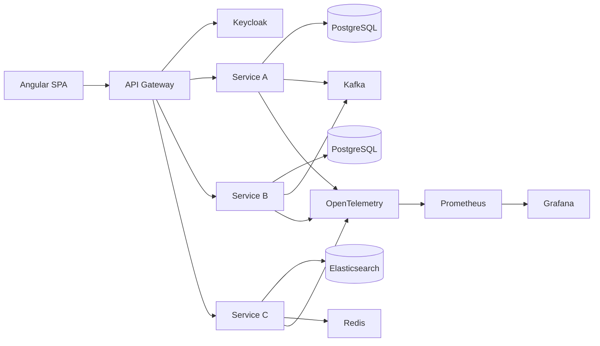

# 10 End-to-End Projects for a Senior Java Backend Developer (10+ Years)

> **Stack constraint (reuse the ShopFast stack):** Spring Boot 3 / Spring Cloud, Apache Kafka, PostgreSQL (database-per-service), Redis, Elasticsearch, Keycloak (OAuth2/OIDC), Angular (frontend), Docker + Docker Compose / Kubernetes, Resilience4j, OpenTelemetry + Prometheus + Grafana, Testcontainers, MapStruct, Lombok, Flyway/Liquibase, common-lib shared module.
>
> **Goal:** 10 production-grade, full-stack (FE + BE) projects, each demonstrating a distinct senior-level architectural pattern or domain, built from scratch.

---

## 1. Common Reusable Architecture (Template for All 10 Projects)

Every project below reuses this skeleton. You build it once as a `common-lib` + `platform-template` and clone it per project, swapping the domain services.

### 1.1 Backend Platform
- **API Gateway** — Spring Cloud Gateway, Keycloak JWT validation, rate limiting, route-by-service.
- **Auth Service** — Keycloak realm per project, service-account roles, token relay.
- **Domain Microservices** — Spring Boot 3, PostgreSQL each, Flyway migrations, MapStruct DTO mapping, Lombok.
- **Event Bus** — Apache Kafka (topics per domain event), Outbox pattern for atomic DB+event.
- **Caching** — Redis (cache-aside) for hot reads (catalog, sessions, lookups).
- **Search** — Elasticsearch for any search/listing heavy domain.
- **Resilience** — Resilience4j circuit breaker, retry, bulkhead, rate limiter on all inter-service calls.
- **Observability** — OpenTelemetry instrumentation, Prometheus scrape, Grafana dashboards, distributed tracing across Kafka + Feign.
- **Shared Module** — `common-lib` (security autoconfig, DTOs, event types, exceptions, utils) exactly like the current ShopFast `common-lib`.

### 1.2 Frontend Platform (Angular)
- Standalone components, `app.config.ts` bootstrap, lazy-loaded feature modules, Keycloak Angular guard (`admin-auth.guard.ts` pattern), RxJS data services, NgRx or signals for state, responsive UI, admin + customer portals.

### 1.3 Common Mermaid Diagram

### 1.4 Cross-Cutting Build Steps (applies to every project)
1. Scaffold `common-lib` (copy from ShopFast) + `docker-compose.yml` (Postgres, Kafka, Redis, ES, Keycloak, Prometheus, Grafana).
2. Generate Keycloak realm + clients via `grant-service-account-roles.sh` pattern.
3. Scaffold API Gateway with route + security config.
4. Build domain services with Flyway migrations, repository, service, controller, DTOs.
5. Wire Kafka producers/consumers with Outbox pattern.
6. Add Resilience4j configs + OpenTelemetry agent.
7. Build Angular app (customer + admin shells, guards, services, pages).
8. Add Testcontainers integration tests + contract tests.
9. Add GitHub Actions CI (build, test, sonar, docker push) + ArgoCD/GitOps deploy.
10. Document ADRs + architecture diagram + README badges.

---

## 2. The 10 Projects

### Project 1 — Food Delivery Platform (UberEats-style)
- **Domain:** Restaurants, menus, live order tracking, delivery partners, payments.
- **Services:** `restaurant-service`, `menu-service`, `order-service`, `delivery-service`, `payment-service`, `notification-service`, `location-service` (geo tracking via Kafka + WebSocket).
- **Senior Patterns:** Saga choreography for order→payment→delivery; real-time location streaming (Kafka + WebSocket to Angular); CQRS for order history; outbox for payment events.
- **Frontend:** Customer app (browse, cart, live tracking map), Restaurant admin (menu mgmt, order board), Driver app (accept jobs, GPS).
- **Build Steps:** Gateway + auth → restaurant/menu (Postgres + ES search) → order saga (Kafka) → delivery location service (Redis geo) → Angular customer + admin + driver shells → OTel tracing of full order flow.

### Project 2 — Digital Banking Core (Fintech)
- **Domain:** Accounts, transfers, ledger, fraud detection, statements.
- **Services:** `account-service`, `transaction-service`, `ledger-service` (event-sourced), `fraud-service`, `notification-service`, `reporting-service`.
- **Senior Patterns:** Event Sourcing + CQRS for the ledger (append-only event store in Postgres, read models in ES); idempotency for transfers; saga for multi-account transactions; audit logging.
- **Frontend:** Internet banking dashboard (balances, transfer, statements), Admin/risk console.
- **Build Steps:** Event store schema (Flyway) → command/query sides → fraud rules engine consuming transaction events → Angular dashboard with charts → resilience + tracing.

### Project 3 — Healthcare Appointment & EHR System
- **Domain:** Patients, doctors, appointments, prescriptions, medical records.
- **Services:** `patient-service`, `doctor-service`, `appointment-service`, `prescription-service`, `notification-service`, `document-service` (records storage).
- **Senior Patterns:** Multi-tenant isolation per clinic; field-level encryption (extend `PasswordEncryptionUtil` to AES-256-GCM for PHI); optimistic locking for concurrent edits; audit trail.
- **Frontend:** Patient portal (book, view records), Clinician portal (schedule, prescribe), Admin.
- **Build Steps:** Tenant context propagation → encryption util → appointment booking with conflict resolution → Angular patient + clinician shells → security hardening + compliance docs.

### Project 4 — Ride-Sharing / Fleet Management
- **Domain:** Drivers, riders, trips, dynamic pricing, live tracking, payouts.
- **Services:** `rider-service`, `driver-service`, `trip-service`, `pricing-service`, `location-service`, `payment-service`, `notification-service`.
- **Senior Patterns:** Geo-spatial queries (Redis/PostGIS), event-driven trip lifecycle saga, dynamic pricing via stream processing, WebSocket live tracking.
- **Frontend:** Rider app (request, track, pay), Driver app (online, accept, navigate), Ops console.
- **Build Steps:** Location streaming (Kafka) → trip saga → pricing engine → Angular rider/driver/ops → load test + bulkhead tuning.

### Project 5 — Learning Management System (LMS)
- **Domain:** Courses, enrollments, lessons, assessments, certifications, video.
- **Services:** `course-service`, `enrollment-service`, `assessment-service`, `progress-service`, `certificate-service`, `media-service` (video metadata), `notification-service`.
- **Senior Patterns:** CQRS for course catalog (ES search), event-driven progress tracking, certificate generation via saga, content delivery via presigned URLs.
- **Frontend:** Student portal (learn, quiz, certificate), Instructor portal (author course), Admin.
- **Build Steps:** Course catalog + ES → enrollment events → assessment engine → Angular student/instructor → analytics dashboards.

### Project 6 — Hotel & Vacation Rental Booking
- **Domain:** Properties, availability, bookings, payments, reviews.
- **Services:** `property-service`, `availability-service` (CQRS), `booking-service`, `payment-service`, `review-service`, `search-service` (ES), `notification-service`.
- **Senior Patterns:** CQRS for availability (write PG, read ES), optimistic concurrency for booking, saga for booking→payment→confirmation, rate limiting at gateway.
- **Frontend:** Traveler app (search, book, review), Host portal (listings, calendar), Admin.
- **Build Steps:** Property + availability models → search (ES) → booking saga → Angular traveler/host → cache invalidation strategy.

### Project 7 — Social Content Platform
- **Domain:** Users, posts, feed, follows, media, notifications, search.
- **Services:** `user-service`, `post-service`, `feed-service` (event-driven fan-out), `media-service`, `notification-service`, `search-service` (ES), `timeline-service`.
- **Senior Patterns:** Event-driven feed fan-out (Kafka), CQRS read models for timelines, Elasticsearch social search, async media processing.
- **Frontend:** Social app (feed, post, profile, search), Moderator console.
- **Build Steps:** Post events → feed fan-out consumer → timeline read model → media pipeline → Angular social shell → real-time notifications (WebSocket).

### Project 8 — Warehouse & Inventory Management (WMS)
- **Domain:** Warehouses, stock, inbound/outbound, picking, reporting.
- **Services:** `warehouse-service`, `inventory-service`, `order-fulfillment-service`, `supplier-service`, `reporting-service`, `notification-service`.
- **Senior Patterns:** Event sourcing for stock movements, CQRS for stock views, saga for fulfillment, bulk operations with batch processing, read replicas for reporting.
- **Frontend:** Warehouse ops UI (scan, pick, pack), Manager dashboard (stock, reports), Supplier portal.
- **Build Steps:** Stock event store → fulfillment saga → reporting read models → Angular ops/manager/supplier → performance tuning (indexes, pools).

### Project 9 — Job Portal & Recruitment Platform
- **Domain:** Candidates, employers, job posts, applications, matching.
- **Services:** `candidate-service`, `employer-service`, `job-service`, `application-service`, `matching-service` (ES), `notification-service`.
- **Senior Patterns:** Elasticsearch relevance scoring for matching, CQRS for job search, event-driven application pipeline, rate limiting for scrapers.
- **Frontend:** Candidate app (profile, apply, track), Employer app (post, review), Admin.
- **Build Steps:** Job + candidate indexing (ES) → matching query API → application events → Angular candidate/employer → relevance tuning.

### Project 10 — Multi-Tenant SaaS Analytics / BI Platform
- **Domain:** Tenants, data ingestion, queries, dashboards, billing.
- **Services:** `tenant-service`, `ingestion-service`, `query-service`, `dashboard-service`, `billing-service`, `notification-service`.
- **Senior Patterns:** Multi-tenancy (shared DB + discriminator vs schema-per-tenant), CQRS + event sourcing for metrics, tenant-aware rate limiting, feature flags (Unleash), usage metering.
- **Frontend:** Tenant admin (onboard, dashboards), End-user analytics dashboards, Super-admin.
- **Build Steps:** Tenant context filter → ingestion pipeline (Kafka) → query/read models → Angular multi-tenant dashboards → billing metering + SLOs.

---

## 3. Senior-Level Skills Demonstrated Across the Set

| Skill | Projects |
|-------|----------|
| Saga / Choreography | 1, 2, 4, 6, 8 |
| Event Sourcing | 2, 8, 10 |
| CQRS | 1, 2, 5, 6, 7, 8, 9, 10 |
| Multi-tenancy | 3, 10 |
| Real-time / WebSocket + Kafka | 1, 4, 7 |
| Geo / Spatial | 4, 6 |
| Search Relevance (ES) | 5, 6, 7, 9 |
| Security / Encryption / Compliance | 2, 3 |
| Resilience Tuning | all |
| Observability / SLOs | all |

---

## 4. Recommended Execution Order (by difficulty)
1. Project 6 (Booking) — gentle intro to CQRS + saga.
2. Project 1 (Food Delivery) — real-time + saga.
3. Project 9 (Job Portal) — ES search focus.
4. Project 5 (LMS) — content + events.
5. Project 7 (Social) — feed fan-out (harder event design).
6. Project 8 (WMS) — event sourcing + batch.
7. Project 4 (Ride-Sharing) — geo + streaming.
8. Project 3 (Healthcare) — multi-tenant + encryption.
9. Project 2 (Banking) — event sourcing + audit (highest compliance).
10. Project 10 (SaaS BI) — multi-tenant + metering (capstone).

---

## 5. Deliverables Per Project (Definition of Done)
- [ ] `common-lib` + `docker-compose.yml` running locally.
- [ ] API Gateway + Keycloak auth working (customer + admin roles).
- [ ] All domain services with Flyway migrations, >80% test coverage (Testcontainers).
- [ ] Kafka events with Outbox pattern; at least one saga implemented.
- [ ] Redis caching with invalidation strategy documented.
- [ ] Elasticsearch search where applicable, with index lifecycle.
- [ ] Angular customer + admin portals (responsive, guarded).
- [ ] OpenTelemetry + Prometheus + Grafana dashboards; p99 < 200ms target.
- [ ] Resilience4j configs (circuit breaker, bulkhead, rate limiter).
- [ ] GitHub Actions CI + ArgoCD deploy manifests.
- [ ] ADR docs + architecture diagram + README.

---

*Plan generated for senior Java backend portfolio. All projects reuse the ShopFast technology stack; only domains and emphasized patterns differ.*
