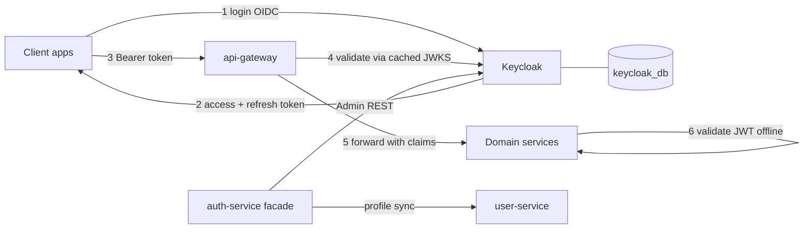

# Keycloak Integration Plan — ShopFast

## 1. Current State

- `auth-service` issues its own HS256 JWTs (`jwt.secret` = shared `JWT_SECRET`).
- The same symmetric secret is copied into `api-gateway` (and likely every service) so any service can *mint* tokens, not just verify them.
- Passwords are stored in `auth_db` and additionally AES-GCM "encrypted" in transit via `APP_PASSWORD_ENCRYPTION_KEY` (custom scheme in `PasswordEncryptionUtil`).
- Refresh tokens / logout / revocation are hand-rolled (Redis assumed).
- No social login, no MFA, no admin UI for users/roles.

## 2. Why Keycloak

| Concern | Today | With Keycloak |
|---|---|---|
| Token signing | Symmetric HS256, secret shared with all services → any service can forge tokens | Asymmetric RS256; services only get the public JWKS, cannot forge |
| Key rotation | Manual redeploy of every service | Automatic via JWKS endpoint (`kid` rollover) |
| Standards | Custom endpoints | OAuth2 / OIDC / SAML, works with any client library |
| Refresh / logout / revocation | Custom Redis code to maintain | Built-in refresh rotation, back-channel logout, session management |
| Password storage | Custom hashing + custom AES transport layer | PBKDF2/Argon2 by default, brute-force detection, password policies |
| MFA / TOTP | None | Built-in |
| Social login (Google, Facebook, Apple) | Would need per-provider code | Identity-provider config, zero code |
| Roles / permissions | Custom tables | Realm & client roles, groups, fine-grained authz |
| Admin tooling | Build it yourself | Admin console + Admin REST API |
| Auditing | None | Login events, admin events |
| Multi-app (web, mobile, admin) | One monolithic auth | Separate clients per app, per-app token lifetimes |

**Costs / trade-offs to accept**
- One more stateful container + its own Postgres schema (HA needed in prod).
- Token issuance latency depends on Keycloak availability (mitigated: only *login* depends on it; validation is offline via cached JWKS).
- Learning curve; realm config must be version-controlled as a realm-export JSON, not clicked in the UI.
- Migration of existing users (password hashes are not portable unless you use a custom Keycloak `PasswordHashProvider` or force reset).

**Recommendation:** adopt Keycloak, keep `auth-service` but reduce it to a thin façade (registration orchestration + profile sync with `user-service`), and move all token issuance/validation to Keycloak.

## 3. Target Architecture



- Gateway = first line: rejects invalid/expired tokens, propagates `Authorization` downstream.
- Every service = OAuth2 Resource Server (`spring-boot-starter-oauth2-resource-server`) validating offline against `issuer-uri` JWKS. Defence in depth, no shared secret anywhere.
- Roles: Keycloak realm roles (`ROLE_USER`, `ROLE_ADMIN`, `ROLE_SELLER`) mapped to Spring authorities by a shared `JwtAuthenticationConverter` placed in `common-lib`.

## 4. Realm Design

- Realm: `shopfast`
- Clients:
  - `shopfast-web` — public, PKCE, Authorization Code flow.
  - `shopfast-mobile` — public, PKCE.
  - `shopfast-admin` — confidential, Authorization Code.
  - `shopfast-services` — confidential, client-credentials, for service-to-service Feign calls.
- Roles: `ROLE_USER`, `ROLE_ADMIN`, `ROLE_SELLER`, `ROLE_SUPPORT`.
- Mappers: include `userId` (link to `user-service` PK), `email`, realm roles in access token.
- Token lifetimes: access 5–15 min, refresh 24 h with rotation.
- Export realm to `backend/keycloak/realm-export.json`, imported on container start (`--import-realm`).

## 5. Migration Strategy (zero big-bang)

1. **Phase 0** — Run Keycloak alongside; nothing consumes it yet.
2. **Phase 1** — Services accept *both* legacy HS256 tokens and Keycloak RS256 tokens (dual `JwtDecoder` / `AuthenticationManagerResolver`).
3. **Phase 2** — Frontends switch to Keycloak login. New users created in Keycloak only.
4. **Phase 3** — Bulk-import existing users (`Admin REST partialImport`), either with a custom hash provider or `UPDATE_PASSWORD` required action / one-time reset email.
5. **Phase 4** — Remove legacy JWT issuance, `JWT_SECRET`, `APP_PASSWORD_ENCRYPTION_KEY`, and the custom password/refresh-token code.

## 6. Todo List

See the tracked todo list; summary:

1. Add Keycloak + `keycloak_db` to `docker-compose.yml` / `docker-compose.prod.yml`, with health checks and env vars in `.env.example`.
2. Build the `shopfast` realm (clients, roles, mappers, token lifetimes, brute-force) and export it to `backend/keycloak/realm-export.json`.
3. Add shared security module in `common-lib`: `JwtAuthenticationConverter` (realm-roles → authorities), `SecurityProperties`, common `@EnableMethodSecurity` config.
4. Convert `api-gateway` to an OIDC-aware resource server; drop the shared `JWT_SECRET` filter.
5. Convert each domain service (`user`, `product`, `order`, `cart`, `payment`, `inventory`, `category`, `coupon`, `review`, `admin`, `notification`, `elastic`) to resource server with `issuer-uri`.
6. Configure service-to-service auth: Feign interceptor using client-credentials token from `shopfast-services`.
7. Reduce `auth-service` to a façade over the Keycloak Admin REST API (register, profile sync to `user-service`, admin user ops).
8. Implement dual-token acceptance for the migration window, then remove it.
9. Write the user-migration job (partial import + required actions) and a rollback plan.
10. Update frontends to the Authorization-Code-with-PKCE flow and silent refresh.
11. Tests: `@SpringBootTest` with mock JWTs, Testcontainers Keycloak for integration, gateway contract tests.
12. Ops: Keycloak metrics to Prometheus, alerts in `alerts.yml`, DB backup for `keycloak_db`, HTTPS/hostname config, admin console lockdown.
13. Docs: update `README.md`, `ENVIRONMENT_VARIABLES.md`, `ARCHITECTURE_DIAGRAM.md`, `DEPLOY_RUNBOOK.md`.
14. Cleanup: delete `JWT_SECRET`, `APP_PASSWORD_ENCRYPTION_KEY`, `PasswordEncryptionUtil`, custom refresh-token storage.

## 7. Key Decisions To Confirm

- Keep `auth-service` as a façade vs. delete it entirely and let clients talk to Keycloak directly.
  - **Decided:** kept as a façade. A ShopFast account is a Keycloak identity *plus* a
    `user_db` profile row; something has to create both and roll back if the second fails.
- Password migration: custom hash provider (seamless) vs. forced password reset (simpler, worse UX).
  - **Decided:** forced reset. A custom SPI to read BCrypt hashes is deployable Java
    inside the identity provider — more attack surface and more to maintain than the
    one-time UX cost is worth at this scale.
- Deployment target: single Keycloak container on Hostinger vs. clustered/HA.
  - **Decided:** single container, `KC_CACHE=local`. Keycloak is now a hard dependency
    for authentication, so this is the platform's single point of failure; revisit
    before it matters commercially.

---

## 8. Phase 4 — Cleanup (do NOT start until the gate below is green)

Everything below is deletion. None of it is urgent, and all of it is destructive if
done early. The dual-token path exists precisely so this can wait.

### The gate

Do not begin until **all** of these hold:

1. `LegacyTokensStillInUse` has been silent for longer than the longest refresh-token
   lifetime (30 days). This alert fires on gateway warnings logged whenever an HS256
   token is accepted; silence means no client is presenting one.
2. All frontends (web *and* mobile — mobile lags, because users update apps slowly)
   are on Authorization Code + PKCE.
3. `JWT_SECRET` has been removed from `.env` and the gateway restarted, and a legacy
   token has been confirmed to return 401.

Step 3 is the reversible dry run for the whole phase: it disables the legacy path
without deleting any code, so recovery is putting one line back in `.env`.

### Order of deletion

The order matters — deleting the issuer before the validators leaves a window where
tokens exist that nothing accepts.

**Step 1 — the dual decoder (gateway).**

- Delete `api-gateway/.../security/DualReactiveJwtDecoder.java` and its test.
- In `GatewaySecurityConfig`, replace the custom decoder bean with the default
  `ReactiveJwtDecoders.fromIssuerLocation(...)`. The audience validator stays.
- Remove `JWT_SECRET` from `docker-compose.yml`, `docker-compose.prod.yml`,
  `.env.example`, `.env.production.example` and `generate-secrets.sh`.
- Remove the `LegacyTokensStillInUse` rule from `alerts.yml` — it can no longer fire,
  and a rule that cannot fire is a rule people stop trusting.

**Step 2 — legacy token issuance and password transport (auth-service).**

- Delete the deprecated `POST /api/v1/auth/login` endpoint and the legacy `AuthService`
  token-minting code.
- Delete the refresh-token entity, repository and any `auth_db` tables backing it.
  Keycloak owns refresh tokens now; these rows are stale and contain live-looking
  credentials, which makes them a liability rather than dead weight.
- Delete `RefreshTokenRequestDto`, `LoginRequestDto` and the AES-decryption path.
- Drop the JJWT dependency (`io.jsonwebtoken:jjwt-*`) from every `pom.xml`. Grep
  first — an unrelated module may have picked it up for something else.

**Step 3 — the shared password-encryption utility (common-lib).**

- Delete `common-lib/.../utils/PasswordEncryptionUtil.java`.
- Remove `APP_PASSWORD_ENCRYPTION_KEY` from all compose files, `.env` templates,
  `generate-secrets.sh` and `ENVIRONMENT_VARIABLES.md`.
- Remove the matching encryption helper from the frontend bundle. Leaving it there
  keeps a key in the JavaScript that looks like a secret to the next reader.

**Step 4 — per-service leftovers.**

Grep the whole repo and confirm each of these returns nothing outside of docs:

```bash
grep -rn "JWT_SECRET\|jwtSecret\|PasswordEncryptionUtil\|APP_PASSWORD_ENCRYPTION_KEY" \
  --include='*.java' --include='*.yml' --include='*.xml' .
grep -rln "JwtAuthenticationFilter\|JwtUtils\|JwtTokenProvider" --include='*.java' .
```

Any surviving `JwtAuthenticationFilter` / `JwtUtils` class is dead code that still
compiles, which is the kind of thing that gets copy-pasted back into a new service
two years from now. Delete rather than deprecate.

**Step 5 — documentation.**

- Remove the "Migration note" from `README.md`'s Security section.
- Remove the "Retiring the legacy path" section from `DEPLOY_RUNBOOK.md`.
- Mark the obsolete-variables table in `ENVIRONMENT_VARIABLES.md` as removed rather
  than deleting it outright — operators with an old `.env` need to know why a
  variable vanished.

### Verification after cleanup

```bash
mvn -q clean verify                      # everything still compiles and tests pass
docker compose config -q                 # no unresolved variable references
docker compose up -d --build
curl -s -o /dev/null -w '%{http_code}\n' \
  -H "Authorization: Bearer <old-hs256-token>" http://localhost:8080/api/v1/products   # 401
```

A forged HS256 token returning 401 is the acceptance criterion for the entire
migration: at that point no component in the system can verify — and therefore no
component can forge — a token it did not get from Keycloak.

### What is deliberately *not* deleted

- `auth-service` itself. It still owns registration and profile linkage.
- `auth_db`. It holds audit rows and the profile linkage table.
- The `userId` attribute mapper in the realm. Every domain table is keyed by it;
  removing it orphans all existing data.
